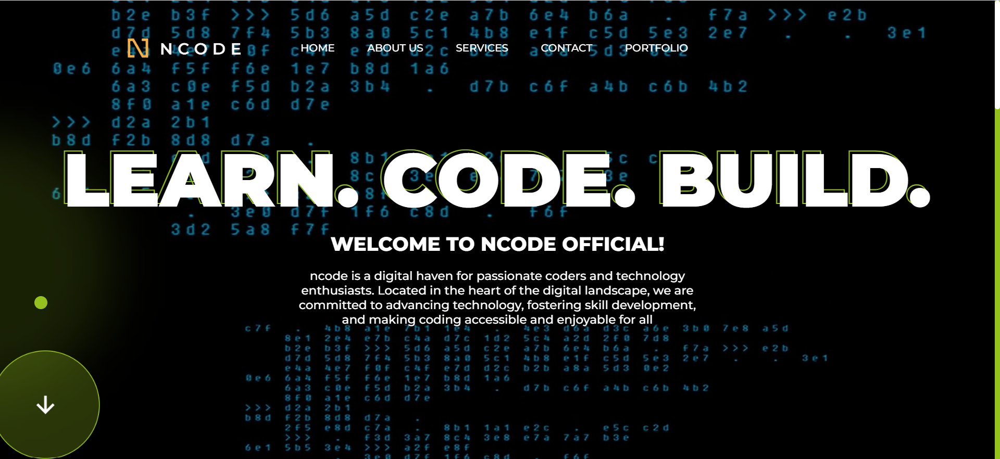

# nCode - Landing Page

## Overview

**nCode** is a landing page project designed to showcase the power of HTML, CSS, JavaScript, GSAP, and GSAP Scroller in creating captivating animated websites. In this README, you'll find an overview of the project, the technologies used, and a section highlighting what we've learned during its development.

## Technologies Used

- **HTML**
- **CSS**
- **JavaScript**
- **GSAP (GreenSock Animation Platform)**
- **GSAP Scroller**

## Project Description

nCode serves as a stunning example of what can be achieved with the combination of HTML, CSS, JavaScript, GSAP, and GSAP Scroller. It's primarily focused on creating an animated landing page that leaves a lasting impression on visitors.

## What We've Learned

While working on nCode, we've gained valuable insights, including:

- **Advanced Front-End Development**: This project has honed our skills in HTML, CSS, and JavaScript, enabling us to create intricate animations and interactive elements.

- **GSAP Mastery**: Working with GSAP and GSAP Scroller has deepened our understanding of creating smooth and captivating web animations.

- **Responsive Design**: We've ensured that nCode is responsive, providing an optimal user experience on various devices.

- **Animation Best Practices**: We've learned the best practices for creating visually appealing animations that engage users effectively.

## Getting Started

To explore the nCode landing page and experience the animations:

1. Clone or download the project repository.

2. Open the `index.html` file in your web browser to view the landing page.

## Feedback and Contributions

Feedback and contributions are always welcome! If you'd like to contribute or provide feedback, please feel free to reach out to us through the contact information provided in the project repository.

## License

This project is open-source and available under the [MIT License](LICENSE).

## Author

- GitHub: [Saurabh13042004](https://github.com/Saurabh13042004)
- LinkedIn: [saurabh-shukla](https://www.linkedin.com/in/saurabh-shukla-0b45b3224/)
- Email: [saurabh1258.be21@chitkarauniversity.edu.in](mailto:saurabh1258.be21@chitkarauniversity.edu.in)
